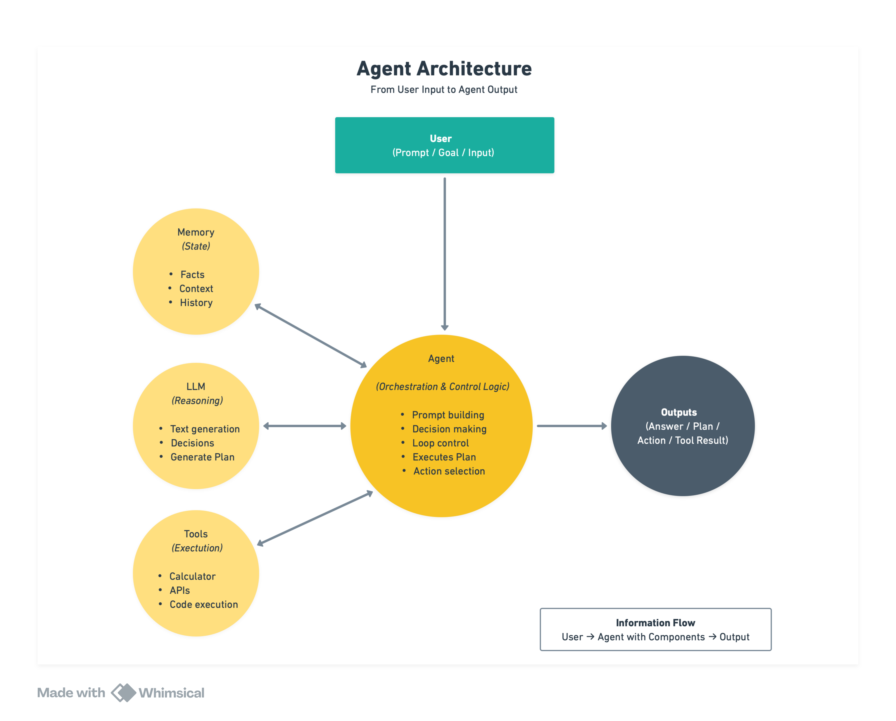

# AI Agents From Scratch

Learn to build AI agents locally without frameworks. Understand what happens under the hood before using production frameworks.




## Purpose

This repository teaches you to build AI agents from first principles using **local LLMs** and **node-llama-cpp**. By working through these examples, you'll understand:

- How LLMs work at a fundamental level
- What agents really are (LLM + tools + patterns)
- How different agent architectures function
- Why frameworks make certain design choices

> A Python version of this tutorial is available here:
> https://github.com/pguso/agents-from-scratch

**Philosophy**: Learn by building. Understand deeply, then use frameworks wisely.

## Companion Website 

This repository now has a **matching companion website**:

**https://agentsfromscratch.com**

The website is **not a replacement for this repo**, but a **conceptual companion** that:

- Explains *why* each example exists  
- Visualizes the learning path from raw LLM calls to full agents  
- Separates **code**, **explanations**, and **core concepts**  
- Helps you understand agent architectures before using frameworks  

**Recommended workflow:**
- Use **GitHub** for running, modifying, and studying the code  
- Use the **website** for mental models, explanations, and progression  

> Think of the site as the *map* and this repo as the *terrain*.

## Agent Fundamentals - From LLMs to ReAct

### Prerequisites
- Node.js 18+
- At least 8GB RAM (16GB recommended)
- Download models and place in `./models/` folder, details in [DOWNLOAD.md](DOWNLOAD.md)

### Installation
```bash
npm install
```

### Run Examples
```bash
node intro/intro.js
node simple-agent/simple-agent.js
node react-agent/react-agent.js
```

## Learning Path

Follow these examples in order to build understanding progressively:

### 1. **Introduction** - Basic LLM Interaction
`intro/` | [Code](examples/01_intro/intro.js) | [Code Explanation](examples/01_intro/CODE.md) | [Concepts](examples/01_intro/CONCEPT.md)

**What you'll learn:**
- Loading and running a local LLM
- Basic prompt/response cycle

**Key concepts**: Model loading, context, inference pipeline, token generation

---

### 2. (Optional) **OpenAI Intro** - Using Proprietary Models
`openai-intro/` | [Code](examples/02_openai-intro/openai-intro.js) | [Code Explanation](examples/02_openai-intro/CODE.md) | [Concepts](examples/02_openai-intro/CONCEPT.md)

**What you'll learn:**
- How to call hosted LLMs (like GPT-4)
- Temperature Control
- Token Usage

**Key concepts**: Inference endpoints, network latency, cost vs control, data privacy, vendor dependence

---

### 3. **Translation** - System Prompts & Specialization
`translation/` | [Code](examples/03_translation/translation.js) | [Code Explanation](examples/03_translation/CODE.md) | [Concepts](examples/03_translation/CONCEPT.md)

**What you'll learn:**
- Using system prompts to specialize agents
- Output format control
- Role-based behavior
- Chat wrappers for different models

**Key concepts**: System prompts, agent specialization, behavioral constraints, prompt engineering

---

### 4. **Think** - Reasoning & Problem Solving
`think/` | [Code](examples/04_think/think.js) | [Code Explanation](examples/04_think/CODE.md) | [Concepts](examples/04_think/CONCEPT.md)

**What you'll learn:**
- Configuring LLMs for logical reasoning
- Complex quantitative problems
- Limitations of pure LLM reasoning
- When to use external tools

**Key concepts**: Reasoning agents, problem decomposition, cognitive tasks, reasoning limitations

---

### 5. **Batch** - Parallel Processing
`batch/` | [Code](examples/05_batch/batch.js) | [Code Explanation](examples/05_batch/CODE.md) | [Concepts](examples/05_batch/CONCEPT.md)

**What you'll learn:**
- Processing multiple requests concurrently
- Context sequences for parallelism
- GPU batch processing
- Performance optimization

**Key concepts**: Parallel execution, sequences, batch size, throughput optimization

---

### 6. **Coding** - Streaming & Response Control
`coding/` | [Code](examples/06_coding/coding.js) | [Code Explanation](examples/06_coding/CODE.md) | [Concepts](examples/06_coding/CONCEPT.md)

**What you'll learn:**
- Real-time streaming responses
- Token limits and budget management
- Progressive output display
- User experience optimization

**Key concepts**: Streaming, token-by-token generation, response control, real-time feedback

---

### 7. **Simple Agent** - Function Calling (Tools)
`simple-agent/` | [Code](examples/07_simple-agent/simple-agent.js) | [Code Explanation](examples/07_simple-agent/CODE.md) | [Concepts](examples/07_simple-agent/CONCEPT.md)

**What you'll learn:**
- Function calling / tool use fundamentals
- Defining tools the LLM can use
- JSON Schema for parameters
- How LLMs decide when to use tools

**Key concepts**: Function calling, tool definitions, agent decision making, action-taking

**This is where text generation becomes agency!**

---

### 8. **Simple Agent with Memory** - Persistent State
`simple-agent-with-memory/` | [Code](examples/08_simple-agent-with-memory/simple-agent-with-memory.js) | [Code Explanation](examples/08_simple-agent-with-memory/CODE.md) | [Concepts](examples/08_simple-agent-with-memory/CONCEPT.md)

**What you'll learn:**
- Persisting information across sessions
- Long-term memory management
- Facts and preferences storage
- Memory retrieval strategies

**Key concepts**: Persistent memory, state management, memory systems, context augmentation

---

### 9. **ReAct Agent** - Reasoning + Acting
`react-agent/` | [Code](examples/09_react-agent/react-agent.js) | [Code Explanation](examples/09_react-agent/CODE.md) | [Concepts](examples/09_react-agent/CONCEPT.md)

**What you'll learn:**
- ReAct pattern (Reason → Act → Observe)
- Iterative problem solving
- Step-by-step tool use
- Self-correction loops

**Key concepts**: ReAct pattern, iterative reasoning, observation-action cycles, multi-step agents

**This is the foundation of modern agent frameworks!**

---

### 10. **AoT Agent** - Atom of Thought Planning
`aot-agent/` | [Code](examples/10_aot-agent/aot-agent.js) | [Code Explanation](examples/10_aot-agent/CODE.md) | [Concepts](examples/10_aot-agent/CONCEPT.md)

**What you'll learn:**
- Atom of Thought methodology
- Atomic planning for multi-step computations
- Dependency management between operations
- Structured JSON output for reasoning plans
- Deterministic execution of plans

**Key concepts**: AoT planning, atomic operations, dependency resolution, plan validation, structured reasoning

---

### 11. **Error Handling** - Resilience for LLM + Tools
`error-handling/` | [Code](examples/11_error-handling/error-handling.js) | [Code Explanation](examples/11_error-handling/CODE.md) | [Concepts](examples/11_error-handling/CONCEPT.md)

**What you'll learn:**
- Typed error taxonomy (validation, LLM, tools, workflow) with stable codes
- Timeouts, retries with backoff/jitter, and classifying transient failures
- Graceful degradation when the LLM path fails (deterministic tool fallback)
- Orchestration-level errors (`AgentWorkflowError`) and correlation ids for support

**Key concepts**: Error taxonomy, retry policies, timeouts, fallbacks, degraded mode, observability, user-safe messaging

---

### 12. **Tree of Thought** - Search over reasoning branches
`tree-of-thought/` | [Code](examples/12_tree-of-thought/tree-of-thought.js) | [Code Explanation](examples/12_tree-of-thought/CODE.md) | [Concepts](examples/12_tree-of-thought/CONCEPT.md)

**What you'll learn:**
- Generating multiple candidate next actions from the same partial plan
- Ranking and pruning branches with a deterministic score in code
- Running a compact beam search loop with inspectable kept/pruned decisions
- Verifying the winning path with explicit sanity checks

**Key concepts**: Tree of Thought, beam search, branch pruning, verifiable objectives, search controllers

---

### 13. **Graph of Thought** - DAG merge for multi-source outputs
`graph-of-thought/` | [Code](examples/13_graph-of-thought/graph-of-thought.js) | [Code Explanation](examples/13_graph-of-thought/CODE.md) | [Concepts](examples/13_graph-of-thought/CONCEPT.md)

**What you'll learn:**
- Modeling reasoning as a DAG: parallel source extracts → merge rules → final draft
- Resolving conflicts explicitly before generation (`must_include`, `must_avoid`, `conflict_notes`)
- Adding deterministic merge and draft compliance checks
- Running independent nodes in parallel to reduce latency

**Key concepts**: Graph of Thought, DAG orchestration, multi-source fusion, merge-before-generate, policy reconciliation

**Decision guide**: use ToT when you need to search competing paths; use GoT when you need to combine multiple sources into one consistent policy. Compare both in:
- [ToT concept](examples/12_tree-of-thought/CONCEPT.md)
- [GoT concept](examples/13_graph-of-thought/CONCEPT.md)

---

### 14. **Chain of Thought** - Auditable stepwise decisioning
`chain-of-thought/` | [Code](examples/14_chain-of-thought/chain-of-thought.js) | [Code Explanation](examples/14_chain-of-thought/CODE.md) | [Concepts](examples/14_chain-of-thought/CONCEPT.md)

**What you'll learn:**
- Splitting a high-stakes decision into explicit reasoning phases
- Preventing early bias with a facts-only extraction step
- Balancing fraud signals with legitimacy evidence before policy application
- Producing an auditable final decision with customer-safe and internal outputs

**Key concepts**: Chain of Thought, structured reasoning traces, policy-constrained decisions, explainability, review-ready workflows

---

## Documentation Structure

Each example folder contains:

- **`<name>.js`** - The working code example
- **`CODE.md`** - Step-by-step code explanation
- Line-by-line breakdowns
- What each part does
- How it works
- **`CONCEPT.md`** - High-level concepts
- Why it matters for agents
- Architectural patterns
- Real-world applications
- Simple diagrams

## Core Concepts

### What is an AI Agent?

```
AI Agent = LLM + System Prompt + Tools + Memory + Reasoning Pattern
           ─┬─   ──────┬──────   ──┬──   ──┬───   ────────┬────────
            │          │           │       │              │
         Brain      Identity    Hands   State         Strategy
```

### Evolution of Capabilities

```
1. intro          → Basic LLM usage
2. translation    → Specialized behavior (system prompts)
3. think          → Reasoning ability
4. batch          → Parallel processing
5. coding         → Streaming & control
6. simple-agent   → Tool use (function calling)
7. memory-agent   → Persistent state
8. react-agent    → Strategic reasoning + tool use
```

### Architecture Patterns

**Simple Agent (Steps 1-5)**
```
User → LLM → Response
```

**Tool-Using Agent (Step 6)**
```
User → LLM ⟷ Tools → Response
```

**Memory Agent (Step 7)**
```
User → LLM ⟷ Tools → Response
       ↕
     Memory
```

**ReAct Agent (Step 8)**
```
User → LLM → Think → Act → Observe
       ↑      ↓      ↓      ↓
       └──────┴──────┴──────┘
           Iterate until solved
```

## ️ Helper Utilities

### PromptDebugger
`helper/prompt-debugger.js`

Utility for debugging prompts sent to the LLM. Shows exactly what the model sees, including:
- System prompts
- Function definitions
- Conversation history
- Context state

Usage example in `simple-agent/simple-agent.js`

## ️ Project Structure - Fundamentals

```
ai-agents/
├── README.md                          ← You are here
├─ examples/
├── 01_intro/
│   ├── intro.js
│   ├── CODE.md
│   └── CONCEPT.md
├── 02_openai-intro/
│   ├── openai-intro.js
│   ├── CODE.md
│   └── CONCEPT.md
├── 03_translation/
│   ├── translation.js
│   ├── CODE.md
│   └── CONCEPT.md
├── 04_think/
│   ├── think.js
│   ├── CODE.md
│   └── CONCEPT.md
├── 05_batch/
│   ├── batch.js
│   ├── CODE.md
│   └── CONCEPT.md
├── 06_coding/
│   ├── coding.js
│   ├── CODE.md
│   └── CONCEPT.md
├── 07_simple-agent/
│   ├── simple-agent.js
│   ├── CODE.md
│   └── CONCEPT.md
├── 08_simple-agent-with-memory/
│   ├── simple-agent-with-memory.js
│   ├── memory-manager.js
│   ├── CODE.md
│   └── CONCEPT.md
├── 09_react-agent/
│   ├── react-agent.js
│   ├── CODE.md
│   └── CONCEPT.md
├── 10_aot-agent/
│   ├── aot-agent.js
│   ├── CODE.md
│   └── CONCEPT.md
├── 11_error-handling/
│   ├── error-handling.js
│   ├── CODE.md
│   └── CONCEPT.md
├── 12_tree-of-thought/
│   ├── tree-of-thought.js
│   ├── CODE.md
│   └── CONCEPT.md
├── 13_graph-of-thought/
│   ├── graph-of-thought.js
│   ├── CODE.md
│   └── CONCEPT.md
├── 14_chain-of-thought/
│   ├── chain-of-thought.js
│   ├── CODE.md
│   └── CONCEPT.md
├── helper/
│   └── prompt-debugger.js
├── models/                             ← Place your GGUF models here
└── logs/                               ← Debug outputs
```

## Additional Resources

- **node-llama-cpp**: [GitHub](https://github.com/withcatai/node-llama-cpp)
- **Model Hub**: [Hugging Face](https://huggingface.co/models?library=gguf)
- **GGUF Format**: Quantized models for local inference

## Contributing

This is a learning resource. Feel free to:
- Suggest improvements to documentation
- Add more example patterns
- Fix bugs or unclear explanations
- Share what you built!

## License

Educational resource - use and modify as needed for learning.

---

**Built with ❤️ for people who want to truly understand AI agents**

Start with `intro/` and work your way through. Each example builds on the previous one. Read both CODE.md and CONCEPT.md for full understanding.

Happy learning! 
